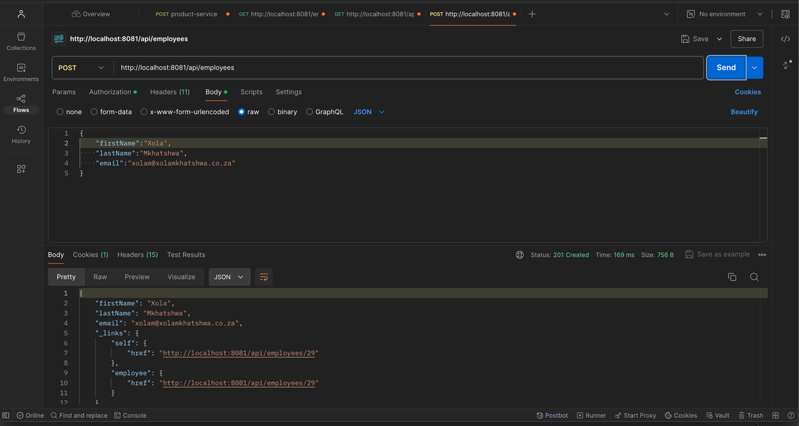
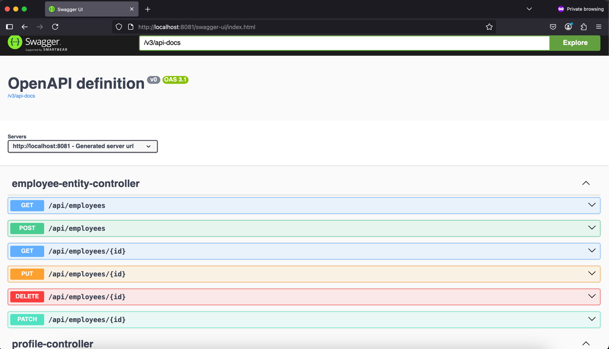

# crud-employee-rest-api

Purpose:
This is a simple CRUD Employee Rest API project to create, fetch, update, and delete employee’s information on the system/ database based on the authorities/ roles they hold in an organization

## Tech Stack
-	Spring Boot 3
-	Spring Core
-	Spring Data JPA
-	Spring Data Rest
-	Spring Data JDBC
-	Spring Actuator
-	Spring Security
-	Spring AOP
-	MySQL Database
-	Lambok
-	Maven
-	Java 21
-	Spring Boot Dev Tools
- Swagger

## Tools
-	IntelliJ Community Edition
-	Postman 
-   Swagger
-	Github
-	Tomcat Server
-	MySQL Workbench 

## Project setup instructions
- Database Development
    - Download and Install MySQL
    - Download and Install MySQL Workbench
    - Run Scripts from the scripts folder
- API Development
    - Download and Install Java JDK 21
    - Download and install IntelliJ Community Edition or IDE of your choice
    - Enable Lombok processing on your IDE
    - Run the code
- Testing
  	- Download and Install Postman or use Swagger as alternative on http://localhost:8081/docs

### API endpoints

| HTTP Method | Endpoint | CRUD Action |
| :---         |     :---:      |          ---: |
| `POST`  | `/api/employees` | Create a new employee    |
| `GET`   | `/api/employees` | Read a list of employees |
| `GET`   | `/api/employees/{employeeId}` | Read a single employee |
| `PUT`   | `/api/employees/{employeeId}` | Update an existing employee |
| `DELETE`   | `/api/employees/{employeeId}` | Delete an existing employee |

#### Examples
Using Basic Auth, username and password. 

Users (messi, ronaldo and james) will perform specific actions based on their roles

- GET: http://localhost:8081/employees
- GET: http://localhost:8081/api/employees/13
- DELETE: http://localhost:8081/api/employees/13
- PUT: http://localhost:8081/api/employees/1
  - Body: 
    `{
        "firstName":"Diego",
        "lastName":"Maradona",
        "email":"diegom@xolamkhatshwa.co.za"
    }`
  - Response:
    `{
          "firstName": "Diego",
          "lastName": "Maradona",
          "email": "diegom@xolamkhatshwa.co.za",
          "_links": {
              "self": {
                  "href": "http://localhost:8081/api/employees/1"
              },
              "employee": {
                  "href": "http://localhost:8081/api/employees/1"
               }
          }
    }`
- POST: http://localhost:8081/api/employees
  - Body: 
    `{
        "firstName":"Xola",
        "lastName":"Mkhatshwa",
        "email":"xolam@xolamkhatshwa.co.za"
    }`
  - Response:
   `{
          "firstName": "Xola",
          "lastName": "Mkhatshwa",
          "email": "xolam@xolamkhatshwa.co.za",
          "_links": {
              "self": {
                  "href": "http://localhost:8081/api/employees/29"
              },
              "employee": {
                  "href": "http://localhost:8081/api/employees/29"
              }
          }
    }`
  

### Actuator endpoints

| HTTP Method | Endpoint |                      Action |
| :---         |     :---:      |----------------------------:|
| `GET`   | `/actuator/info` |         Read info about API |
| `GET`   | `/actuator/health` |          Read status of API |

### Swagger endpoints

| HTTP Method |      Endpoint      |                        Action |
| :---         |:------------------:|------------------------------:|
| `GET`   |      `/docs`       | Read all Swagger exposed APIs |

## Communication

I hope you have fun with this project as I did create it. Please share your thoughts based on your experience. What you have learnt or to improve. Connect with me: linkedin: https://www.linkedin.com/in/xola-mkhatshwa-966482a0/ or email: mkhatshwa.xola@gmail.com or [xolamkhatshwa.com](https://xolamkhatshwa.com/) 

Thank you. 

## Authors

[Xola Mkhatshwa](https://github.com/xmkhatshwa) | Software Engineer

mkhatshwa.xola@gmail.com | [xolamkhatshwa.com](https://xolamkhatshwa.com/)
